# Newton Fractal Lab

A tiny pure-Python lab for one sharp idea: Newton's method does not just find roots, it partitions the complex plane into competing basins of attraction.

This repo starts with the cleanest family to study: `z^n - 1`.
That keeps the algebra simple enough that the geometry gets to be the star.

It now has two bounded asymmetric lanes too: one winner-take-most cubic and one split-critical cubic, both chosen to break the rotational symmetry without turning the repo into a generic polynomial zoo.

## What is here

- pure-Python core for Newton iteration on `z^n - 1`
- bounded cubic-analysis lanes for two carefully chosen asymmetric polynomials with explicit roots, critical points, and grid summaries
- SVG renderer for basin maps with iteration shading
- CLI for single-point reports, grid summaries, family scans, the asymmetric-cubic card, the asymmetric-contrast card, and the cubic-budget persistence pass
- generated gallery for `z^3 - 1`, `z^4 - 1`, and `z^5 - 1`
- a generated power-scan figure that tracks how convergence and basin-share spread drift as `n` increases
- a generated critical-radius scan that makes the derivative singularity at `z = 0` visible as a real convergence problem instead of a throwaway caveat
- a generated slow-convergence histogram figure that shows how much of the sampled square settles early, late, or not at all under one fixed iteration budget
- a generated budget-comparison figure that shows which radial bands were only cutoff-limited and which ones stay stubborn after the iteration budget doubles
- a generated late-tail spatial map that shows where the slow starts actually live on the square instead of collapsing them onto one histogram or one radial axis
- a generated asymmetric-cubic comparison card that separates the unity-family center singularity story from the first effects of broken symmetry
- a generated asymmetric-cubic geometry-contrast card that shows broken symmetry does not force one Newton story: one cubic becomes winner-take-most, while a second split-critical cubic keeps a much more balanced three-way fight and a hotter near-critical lane
- a generated cubic-budget persistence card that checks how much of the old cubic drama survives after the Newton cutoff rises instead of stopping at one low-budget snapshot
- companion notebooks on critical structure, the long iteration tail, the late-tail spatial map, the asymmetric cubic critical-set pass, the asymmetric cubic geometry contrast, and the cubic-budget persistence follow-up
- small tests that check roots, convergence, grid accounting, and the new cubic lane

## Gallery

### `z^3 - 1`

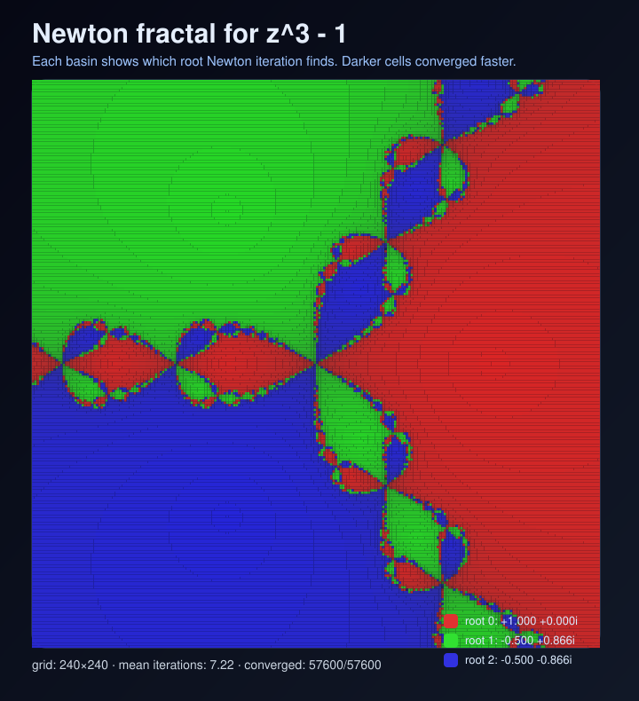

### `z^4 - 1`

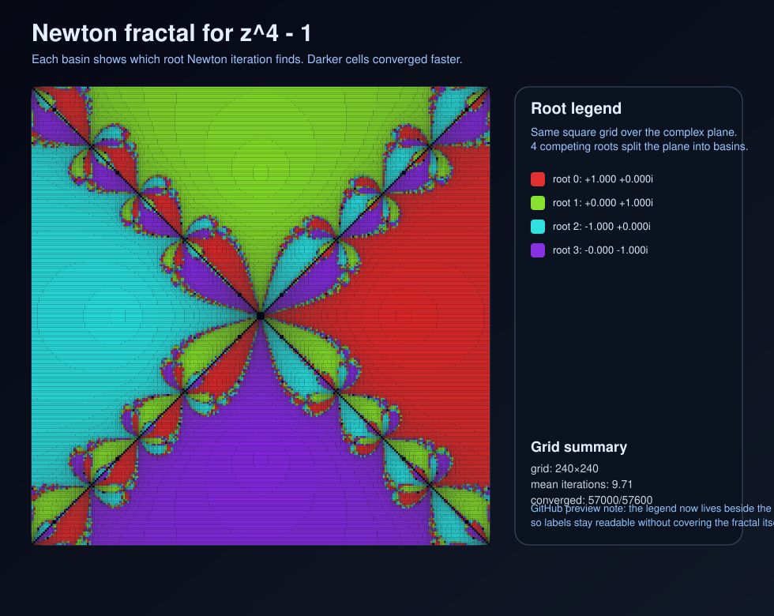

### `z^5 - 1`

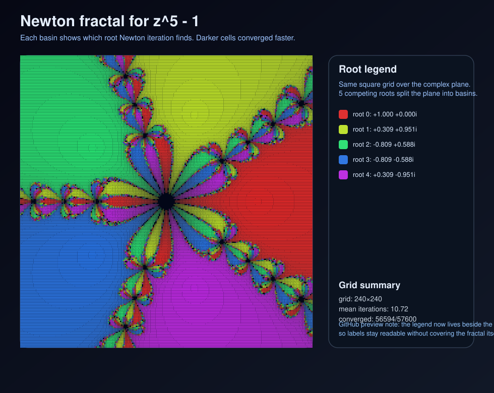

### Unity-family power scan

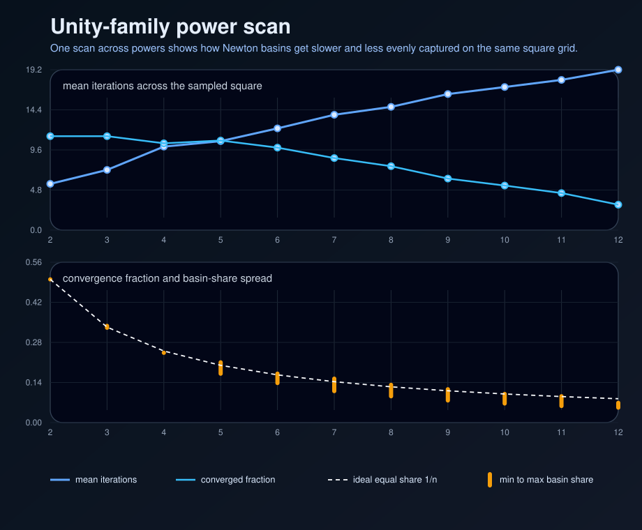

### Critical-radius scan

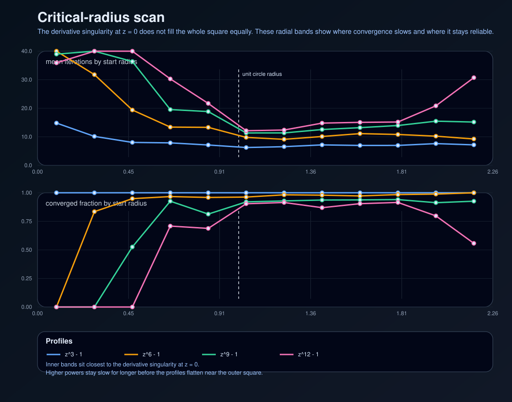

### Slow-convergence histograms

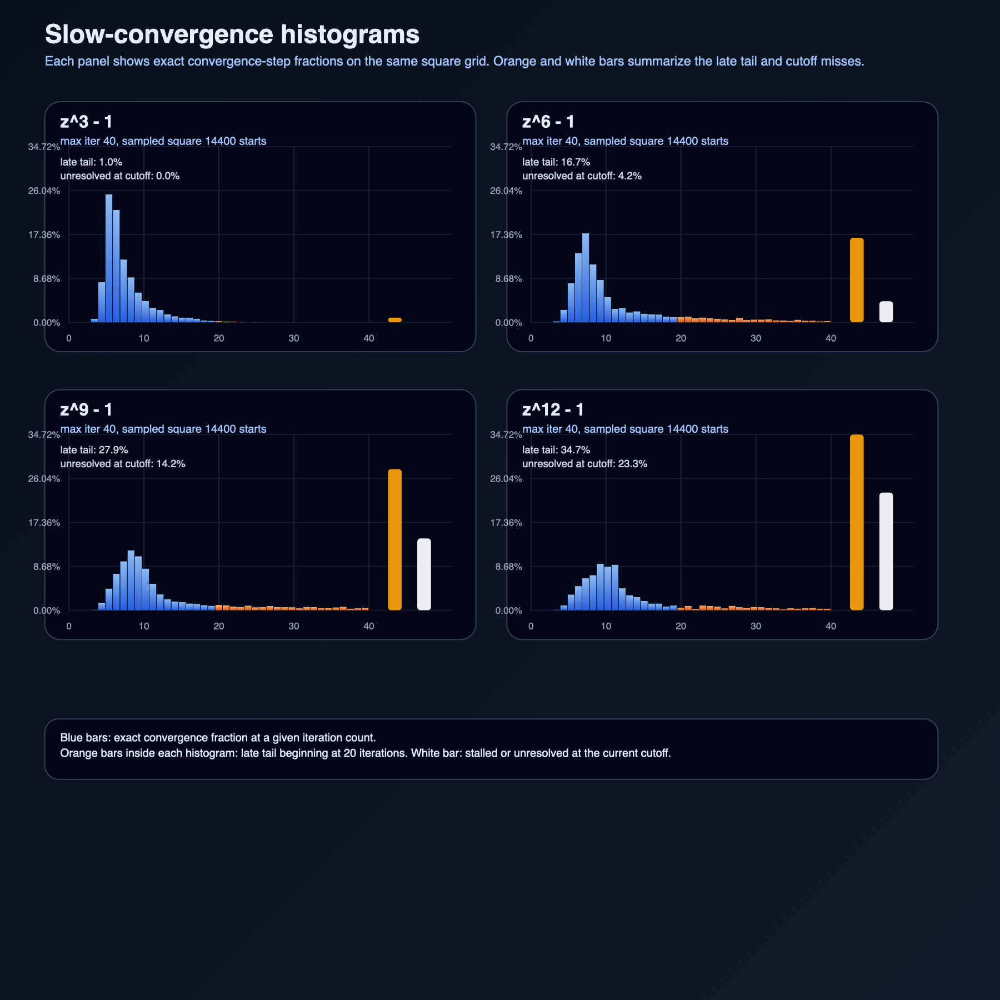

### Iteration-budget radius comparison

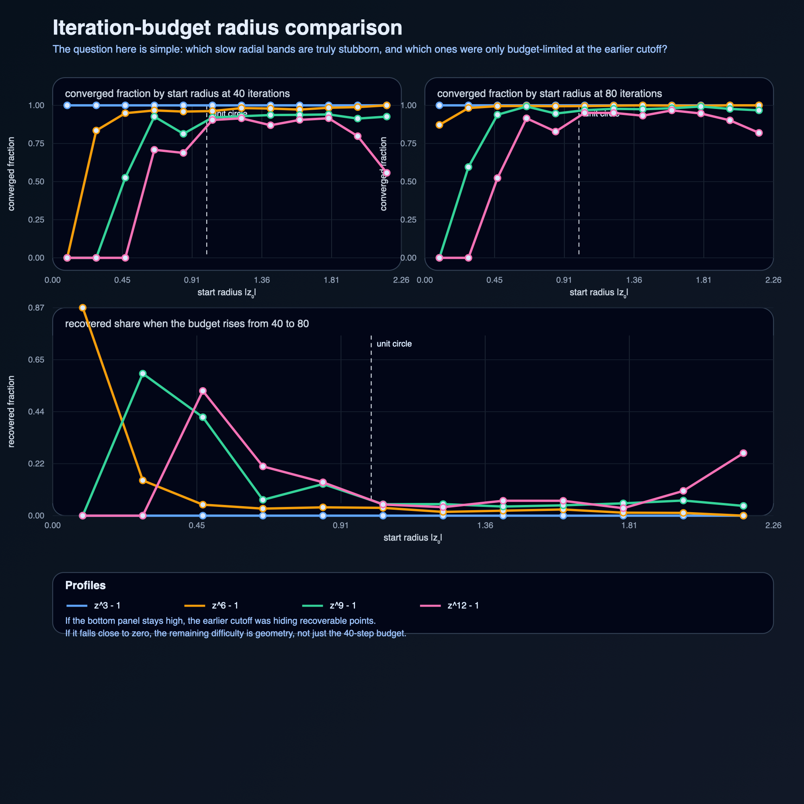

### Late-tail spatial map

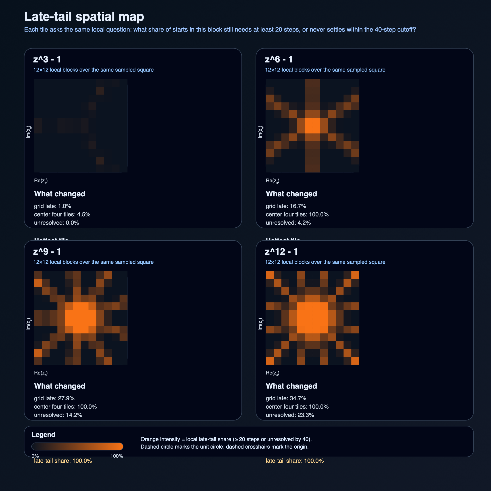

This pass closes a real gap in the earlier notes. The histogram told you how much late-tail mass existed. The radius scan told you the center got hotter as the power rose. The new map shows the missing geometric fact: for low powers the slow starts still sit mostly on thin basin filaments, while higher powers turn the origin neighborhood into a visibly thick finite-budget trap.

### Breaking the cubic symmetry

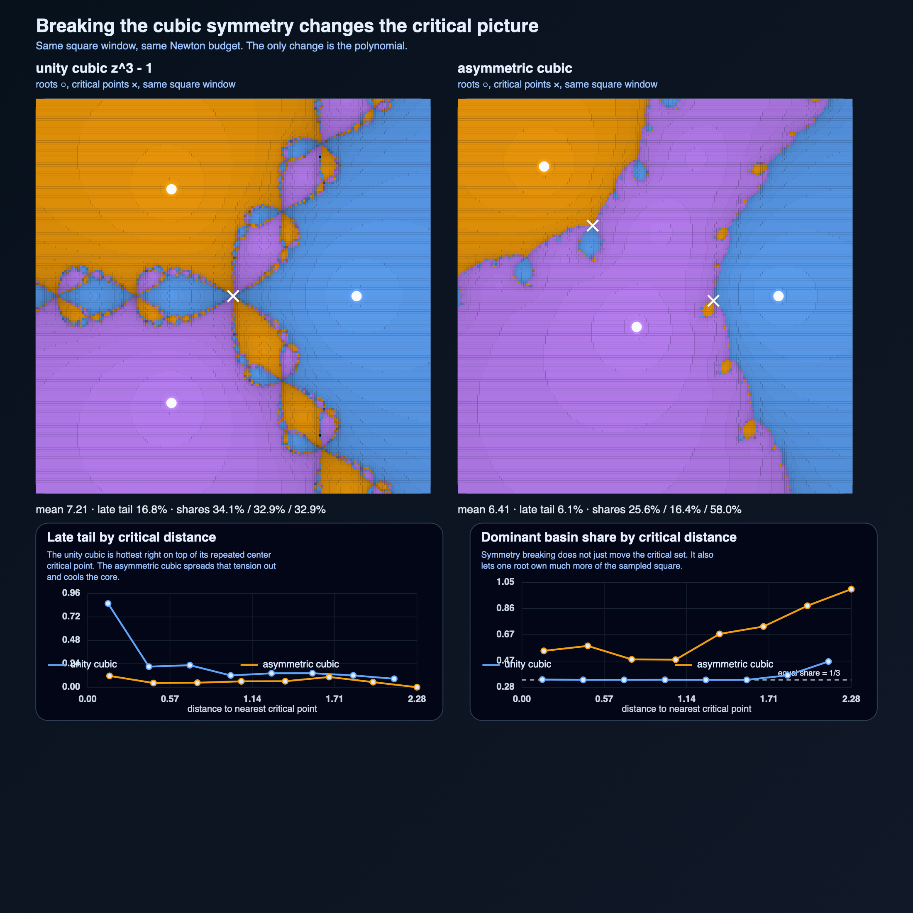

This new sidecar is the repo's first honest move beyond the roots-of-unity family. It compares `z^3 - 1` against one asymmetric cubic with the same Newton budget and shows two things at once: the repeated center critical point stops being the whole story, and one root can start owning far more of the sampled square once the symmetry is broken.

### Asymmetric cubic geometry contrast

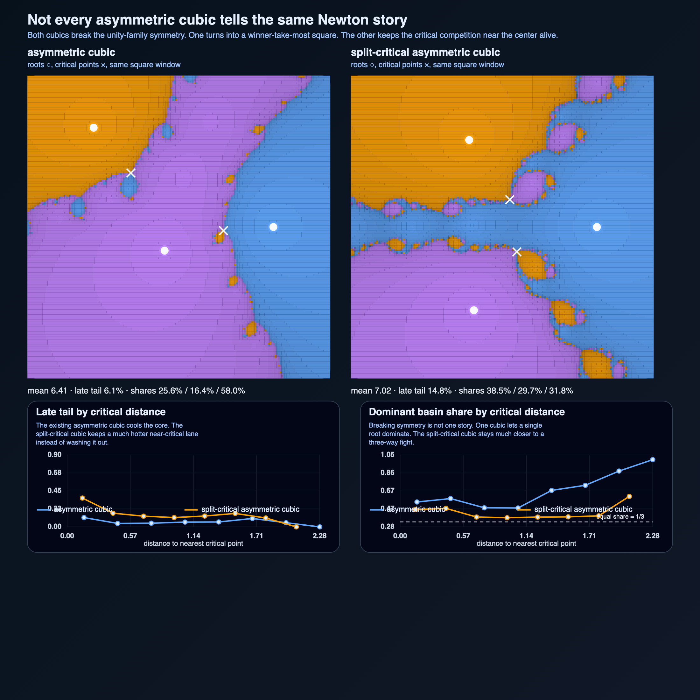

This second asymmetric lane closes the next loophole. The first asymmetric cubic showed that broken symmetry can hand most of the square to one root. The new split-critical cubic shows that broken symmetry can also do something else: keep the basin shares much closer together while the near-critical lane stays hot.

### Cubic budget persistence

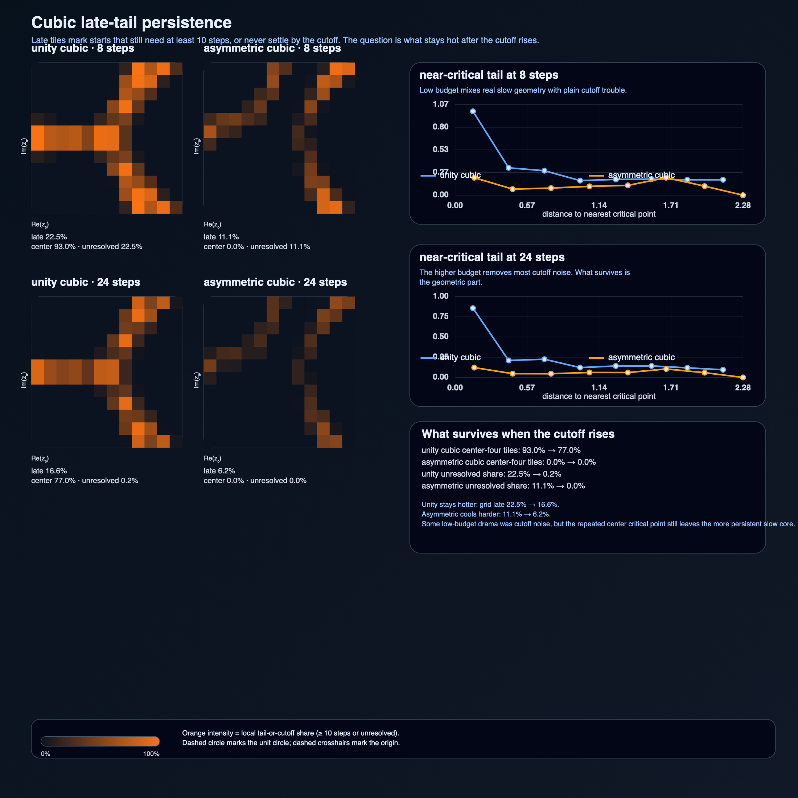

This follow-up keeps the same two cubics and raises the Newton cutoff. That exposes one sharper fact: part of the low-budget heat was just cutoff noise, but the unity cubic still keeps a much fatter slow center after the cutoff rises, while the asymmetric cubic cools much harder.

## Why this repo is worth opening

Newton fractals are an honest example of how a local algorithm creates global structure.
Each point starts with the same update rule.
A tiny change in the initial guess can send the orbit to a different root entirely.
That makes the basin boundaries the interesting part, not just the roots themselves.

This repo is small on purpose:

- no plotting stack,
- no dependency pile,
- no giant symbolic framework,
- just enough code to inspect the iteration, render the geometry, and summarize what the grid is doing.

The new asymmetric-cubic sidecar matters because it keeps the repo honest. A lot of the old reading depended on the unity family's symmetry. Now there is one concrete counterexample lane showing what survives after that symmetry breaks.

The new asymmetric-cubic geometry-contrast sidecar matters because it closes the next loophole too. Broken symmetry is not one story. One cubic turns into winner-take-most basin ownership. Another keeps the competition near the center alive instead of cooling it away.

The late-tail spatial map matters for the same reason. It upgrades the old "higher powers are slower" line into something more geometric: the slow region does not just grow, it changes shape.

The new cubic-budget persistence sidecar matters because it keeps the cubic comparison honest too. A hot map at one cutoff can still be partly budget-limited. The follow-up checks what is still hot after the cutoff rises.

## Quick start

Generate the gallery, power scan, and reports:

```bash
python3 scripts/generate_gallery.py
```

Run the tests:

```bash
python3 -m unittest discover -s tests
```

Render one figure directly:

```bash
python3 -m newton_fractal_lab.cli render --power 6 --width 260 --height 260 --output art/newton-z6-minus-1.svg
```

Inspect one starting point:

```bash
python3 -m newton_fractal_lab.cli report --power 5 --x 0.15 --y 0.15
```

Get a grid summary:

```bash
python3 -m newton_fractal_lab.cli grid-report --power 5 --width 120 --height 120
```

Scan several powers and render the summary figure:

```bash
python3 -m newton_fractal_lab.cli power-scan --power-min 2 --power-max 12 --width 100 --height 100 --output art/unity-power-scan.svg
```

Compare slow-convergence histograms across several powers:

```bash
python3 -m newton_fractal_lab.cli iteration-hist --powers 3,6,9,12 --width 120 --height 120 --max-iter 40 --output art/slow-convergence-histograms.svg
```

Compare the same radial profiles at two iteration budgets:

```bash
python3 -m newton_fractal_lab.cli budget-radius-compare --powers 3,6,9,12 --low-budget 40 --high-budget 80 --output art/iteration-budget-radius-comparison.svg --png-output art/iteration-budget-radius-comparison.png
```

Render the late-tail spatial map:

```bash
python3 -m newton_fractal_lab.cli late-tail-map --powers 3,6,9,12 --late-threshold 20 --output art/late-tail-spatial-map.svg --png-output art/late-tail-spatial-map.png
```

Compare the unity cubic against the new asymmetric cubic lane:

```bash
python3 -m newton_fractal_lab.cli cubic-compare --output art/asymmetric-cubic-critical-set-comparison.svg --png-output art/asymmetric-cubic-critical-set-comparison.png
```

Compare the two asymmetric cubic stories directly:

```bash
python3 -m newton_fractal_lab.cli asymmetric-cubic-contrast --output art/asymmetric-cubic-geometry-contrast.svg --png-output art/asymmetric-cubic-geometry-contrast.png
```

Compare low- and high-budget cubic persistence:

```bash
python3 -m newton_fractal_lab.cli cubic-budget-persistence --output art/cubic-budget-persistence.svg --png-output art/cubic-budget-persistence.png
```

## Repo layout

- `newton_fractal_lab/core.py`: iteration and basin summaries for the unity family
- `newton_fractal_lab/cubic.py`: bounded cubic lanes with explicit roots, critical points, and nearest-critical-point scans
- `newton_fractal_lab/render.py`: SVG renderer with run-length compression across each row plus the family-level scan figures, the budget-comparison card, the cubic-comparison card, the asymmetric-contrast card, and the cubic-budget persistence card
- `newton_fractal_lab/cli.py`: render and reporting commands, including the multi-power scan, the radial critical-structure scan, the late-tail spatial map, the budget-comparison pass, `cubic-compare`, `asymmetric-cubic-contrast`, and `cubic-budget-persistence`
- `scripts/generate_gallery.py`: reproducible gallery and scan build
- `reports/unity-family.md`: generated basin summary for the shipped gallery
- `reports/unity-power-scan.md`: generated summary of how the family drifts across powers
- `reports/critical-structure.md`: generated note on where the derivative singularity shows up most clearly on the sampled square
- `reports/slow-convergence.md`: generated note on how the long iteration tail thickens across the family
- `reports/iteration-budget-comparison.md`: generated note on what disappears with a larger cutoff and what still looks geometrically stubborn
- `reports/late-tail-spatial-map.md`: generated note on where slow starts stay filament-thin and where they condense into a center halo
- `reports/asymmetric-cubic.md`: generated note on what changes first when the cubic symmetry is broken
- `reports/asymmetric-cubic-geometry-contrast.md`: generated note on why two different asymmetric cubics can keep very different critical geometry alive
- `reports/cubic-budget-persistence.md`: generated note on what survives after the cubic cutoff rises
- `notebooks/critical_structure_unity_family.ipynb`: slower companion notebook on derivative singularities, radius bands, and caveats
- `notebooks/slow_convergence_histograms.ipynb`: companion notebook on exact convergence-step counts, cumulative fractions, and cutoff caveats
- `notebooks/late_tail_spatial_map.ipynb`: companion notebook on tiled late-tail occupancy and center-versus-filament comparisons
- `notebooks/asymmetric_cubic_critical_set.ipynb`: companion notebook for the new asymmetric-cubic critical-set pass
- `notebooks/asymmetric_cubic_geometry_contrast.ipynb`: companion notebook for the second asymmetric-cubic contrast pass
- `notebooks/cubic_budget_persistence.ipynb`: companion notebook for the new high-cutoff cubic follow-up
- `tests/test_core.py` and `tests/test_cubic.py`: small verification layer

## Next good questions

- compare the late-tail map at one higher iteration budget only if that reveals a real persistence effect instead of just cooling the same tiles
- push the cubic budget higher again only if the persistence map still changes shape instead of only cooling the same tiles
- try one third cubic only if it reveals a genuinely new critical-set geometry instead of repeating either the winner-take-most or split-critical stories

That is enough to make this a real lab instead of just a pretty image dump.

— Jarbas
